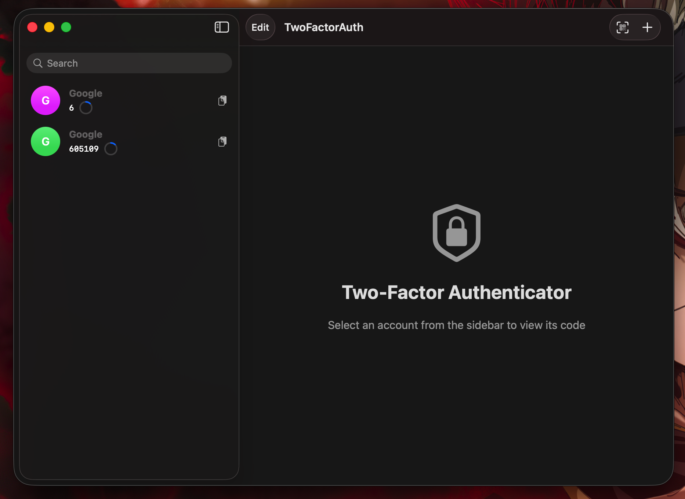
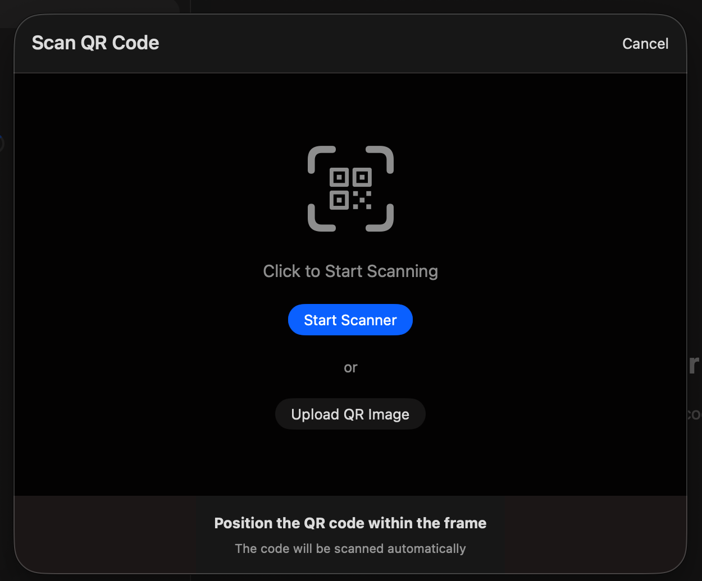

# Two-Factor Authenticator for macOS

A native, secure, and modern 2FA (Two-Factor Authentication) app built with SwiftUI for macOS.



## Features

### Core Functionality
- **TOTP Code Generation** - Generate time-based one-time passwords (6 or 8 digits)
- **Advanced QR Code Scanning** - Multiple scanning methods with enhanced detection
- **Google Authenticator Migration** - Import accounts from Google Authenticator export QR codes
- **Manual Entry** - Add accounts by entering secret keys manually
- **Multiple Algorithms** - Support for SHA1, SHA256, and SHA512
- **Bulk Account Management** - Select and delete multiple accounts at once

### Security
- **Keychain Storage** - All secrets are securely stored in macOS Keychain with device-only access
- **Offline Operation** - No internet connection required, all codes generated locally
- **Native Settings Integration** - Secure preferences with macOS Settings window

### User Experience
- **Native macOS Design** - Built with SwiftUI for a modern Mac experience
- **Account Management** - Add, edit, delete, search, and reorder accounts
- **Enhanced Search & Filter** - Quickly find accounts by name or issuer
- **One-Click Copy** - Copy codes to clipboard instantly with visual feedback
- **Dynamic Visual Indicators** - Color-coded progress bars (green → orange → red)
- **Dark Mode Support** - Automatic theme switching
- **Keyboard Shortcuts** - Cmd+N to add account, Cmd+, for Settings, Escape to cancel
- **Empty State Views** - Helpful guidance when no accounts exist

## Requirements

- macOS 13.0 (Ventura) or later
- Xcode 15.0 or later (for building from source)

## Installation

### Method 1: Build from Source

1. **Clone the repository:**
   ```bash
   git clone https://github.com/brutalharsh/TwoFactorAuth.git
   cd TwoFactorAuth
   ```

2. **Open in Xcode:**
   - Open Xcode
   - File → Open → Select the `TwoFactorAuth` folder
   - Create a new macOS App project with SwiftUI
   - Replace the generated files with the source files

3. **Configure the project:**
   - Set the bundle identifier (e.g., `com.yourname.TwoFactorAuth`)
   - Enable Camera usage in Capabilities
   - Enable Keychain Sharing if needed

4. **Build and Run:**
   - Press `Cmd + R` to build and run
   - Or Archive → Distribute App for release build

### Method 2: Using the Build Script

```bash
chmod +x build.sh
./build.sh
```

## Usage

### Adding Accounts



**Method 1: QR Code Scanning**
The QR scanner now offers multiple capture methods:

1. **Live Camera Scanning**
   - Click the QR code scanner button in the toolbar
   - Allow camera access when prompted
   - Point the camera at the QR code
   - Click the "Capture QR Code" button to scan

2. **Upload QR Code Image**
   - In the QR scanner, click "Upload Image"
   - Select a QR code image file from your computer
   - The app will automatically detect and process the QR code

3. **Screenshot Capture**
   - In the QR scanner, click "Capture Screenshot"
   - The app will scan your screen for any visible QR codes
   - Useful for QR codes displayed on your screen

**Method 2: Google Authenticator Migration**
1. In Google Authenticator, go to Settings → Transfer accounts → Export accounts
2. Scan the migration QR code using any of the methods above
3. All accounts will be imported at once

**Method 3: Manual Entry**
1. Click the "+" button in the toolbar
2. Enter the service name (e.g., "GitHub")
3. Enter your account name or email
4. Paste or type the secret key
5. Optionally configure:
   - Algorithm (SHA1, SHA256, SHA512)
   - Digits (6 or 8)
   - Period (default 30 seconds)
6. Click "Add Account"

**Method 4: Import from URI**
1. Copy an `otpauth://` URI to clipboard
2. The app will automatically detect and offer to import it

### Managing Accounts

- **View Code**: Select an account from the sidebar
- **Copy Code**: Click the copy button or use right-click menu
- **Edit Account**: Right-click → Edit or use the Edit button
- **Delete Account**: Right-click → Delete or swipe left
- **Bulk Delete**: Click "Select" → Choose multiple accounts → Delete
- **Reorder Accounts**: Use up/down buttons to rearrange account order
- **Search**: Use the search bar to filter by account name or issuer
- **Track Usage**: Accounts show when they were last used

### Settings

Access the Settings window via Cmd+, or Menu → Settings:

**General Tab**
- Toggle Touch ID preference (UI only)
- Configure menu bar code display

**Security Tab**
- Clear all accounts with confirmation

**About Tab**
- View app version and information

## Security Considerations

- **Keychain Storage**: All secret keys are stored in the macOS Keychain with `kSecAttrAccessibleWhenUnlockedThisDeviceOnly` flag
- **No Network Access**: The app works completely offline
- **Device-Only Access**: Secrets are only accessible when device is unlocked
- **No Cloud Sync**: All data remains local to your device

## Troubleshooting

### Camera Access Issues
- Go to System Settings → Privacy & Security → Camera
- Ensure TwoFactorAuth has permission enabled
- Try using "Upload Image" or "Capture Screenshot" as alternatives

### QR Code Scanning Issues
- **Manual Capture Required**: The app uses manual capture mode - click "Capture QR Code" button
- **Poor Quality QR**: Try the image enhancement options in the scanner
- **Google Authenticator Export**: Ensure you're scanning the export QR, not a regular account QR
- **Alternative Methods**: Use "Upload Image" for saved QR codes or "Capture Screenshot" for on-screen codes

### Keychain Access Issues
- Restart the app
- Check Keychain Access app for any prompts
- Ensure the app has keychain permissions in System Settings

### Invalid QR Codes
- Ensure the QR code is a valid `otpauth://` or `otpauth-migration://` URI
- Check if the service uses TOTP (not HOTP)
- Try manual entry if QR scanning fails

## Project Structure

```
TwoFactorAuth/
├── TwoFactorAuth/
│   ├── App/
│   │   ├── TwoFactorAuthApp.swift             # Main app entry point
│   │   └── ContentView.swift                  # Main content view with navigation
│   ├── Models/
│   │   ├── Account.swift                      # Account data model
│   │   ├── TOTPGenerator.swift                # TOTP algorithm implementation
│   │   └── GoogleAuthenticatorMigration.swift # Google Auth migration parser
│   ├── Views/
│   │   ├── AccountListView.swift              # Sidebar account list with bulk operations
│   │   ├── AccountDetailView.swift            # Account detail view with code display
│   │   ├── AddAccountView.swift               # Add/Edit account forms
│   │   ├── QRScannerView.swift                # Enhanced QR scanner with multiple methods
│   │   └── SettingsView.swift                 # Native macOS Settings window
│   ├── Services/
│   │   ├── KeychainService.swift              # Keychain operations with secure storage
│   │   └── DataManager.swift                  # Data management layer
│   └── Info.plist                             # App configuration
├── Package.swift                               # Swift Package Manager config
├── build.sh                                    # Build script
└── README.md                                   # This file
```

## Technologies Used

- **SwiftUI** - Modern declarative UI framework
- **CryptoKit** - Apple's cryptography framework for TOTP generation
- **AVFoundation** - Camera access for QR code scanning
- **Security Framework** - Keychain Services for secure storage
- **Combine** - Reactive programming for data binding

## Contributing

Contributions are welcome! Please feel free to submit pull requests.

## License

This project is provided as-is for educational and personal use.

## Acknowledgments

- TOTP algorithm implementation based on [RFC 6238](https://tools.ietf.org/html/rfc6238)
- Base32 encoding/decoding adapted from Swift community implementations

## Support

For issues, questions, or suggestions, please open an issue on GitHub.

---

**Security Notice**: Never share your secret keys or backup files with anyone. Always use strong, unique passwords for your exports.